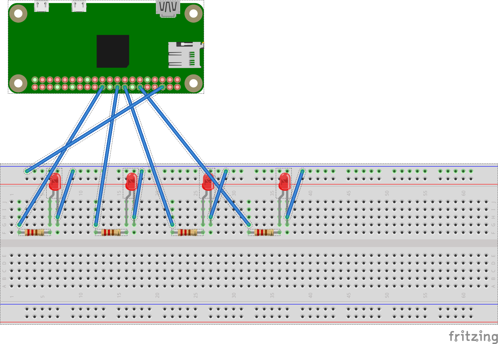

[](https://opensource.org/licenses/MIT)
[]()
[]()
[]()
[]()
[]()

# Project Cocktailmachine

If you've always wanted to build your own cocktailmachine, then you've come to the right place. Here you find all you need, from the accesoires to the code. 
More specific information about testing, existing routes and our data model you will find in our wiki.

## Build status

For continuous integration we use Travis-CI. In our pipeline we use [flake8](https://flake8.pycqa.org/en/latest/), [pytest](https://docs.pytest.org/en/stable/) and [codecav](https://codecov.io/).

[](https://travis-ci.org/yanehi/raspberrypi-cocktailmachine)

## Code style

In our python backend we use flake8 for coding guidelines. 

[](https://codecov.io/gh/yanehi/raspberrypi-cocktailmachine)

## Tech/framework used

* *Backend*
    * Python: [Fastapi](https://fastapi.tiangolo.com/), [RPi.GPIO](https://pypi.org/project/RPi.GPIO/)
    * MongoDB
* *Frontend*
    * ...

## Screenshots

For the access of the GPIOs from the raspberry we use [RPi.GPIO](https://pypi.org/project/RPi.GPIO/).
We use the GPIOS: 18, 23, 24, 25.



## API Reference

For the REST API we use [FastAPI](https://fastapi.tiangolo.com/)

## Commit Guide and Branching

* we use the [Angular commit guide](https://github.com/angular/angular/blob/master/CONTRIBUTING.md).
* branch names: `<issue-number>`-issue-name

## How to use?

Look at  [setup file](./Setup_pi.md) to prepare your RaspberryPi with the prerequisites you need.

### Local development

* install python3.8 and latest pip (debian/ubuntu)

```
apt-get install python3.8
curl https://bootstrap.pypa.io/get-pip.py -o get-pip.py
python get-pip.py
```

* clone project and create `virtualenv`

```
git clone https://github.com/yanehi/raspberrypi-cocktailmachine.git
virtualenv cocktailmachine
source cocktailmachine/bin/activate
```

*  install the dependencies in your `virtualenv`

```
cd raspberrypi-cocktailmachine
pip install -r requirements.txt
```

* start the app and let's shake!

```
coming soon...
```

## License

MIT

## Contributors

* [Janosch Fischer](https://github.com/janosch09)
* [Yannic Nevado](https://github.com/yanehi)


